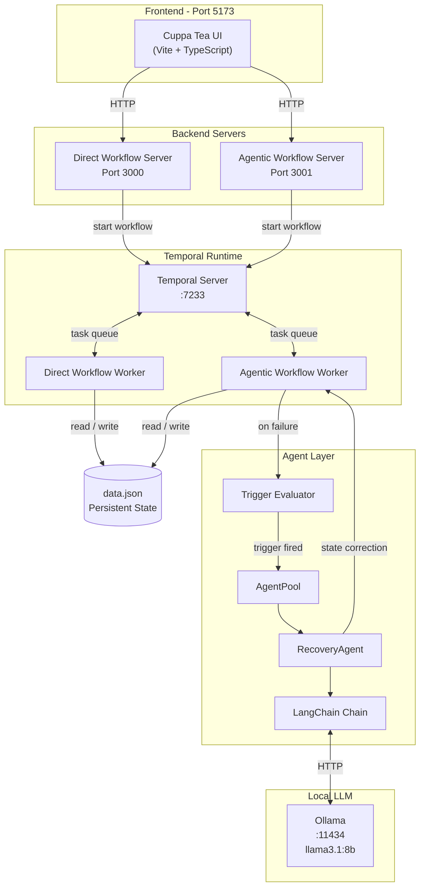
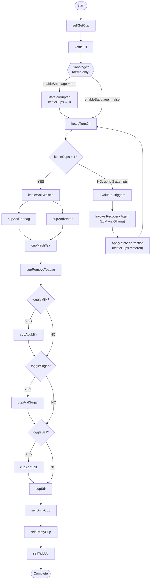
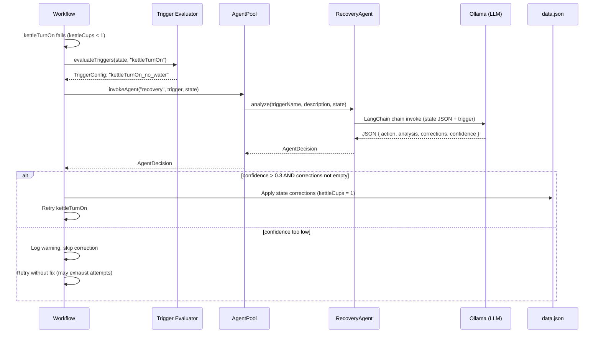

# Resilient Workflows with Temporal & Agent Recovery - Cuppa Tea Example

A proof-of-concept using Temporal for durable workflow execution, with an optional LLM-powered recovery agent that can fix broken state mid-workflow and get things back on track. Built with TypeScript, LangChain, and Ollama.

The domain is deliberately simple (making a cup of tea) so the focus stays on the orchestration and recovery patterns rather than the business logic.

---

## What's in here

Four progressively more capable versions of the same tea-making process:

1. **Manual Process** - click through each step in the UI yourself
2. **Direct Process** - same as manual but auto-executes client-side every second, no Temporal involved
3. **Direct Workflow** - runs inside Temporal for durable execution, but no recovery logic (a self-correction stub exists but is disabled)
4. **Agentic Workflow** - runs in Temporal and when something breaks, invokes a recovery agent backed by a local LLM to diagnose and fix the state before retrying

---

## How the agentic workflow works

### Normal run (happy path)

Temporal executes the 15 activities in sequence. Each one reads and writes `data.json` as its persistent state. Everything succeeds and the workflow completes.

```
Input State → Activity 1 → Activity 2 → ... → Activity N → Final State
```

Given the same input, the workflow always takes the same path. Temporal stores the full history so it can replay from any point after a failure.

### When something goes wrong

For the demo, sabotage is injected after `kettleFill` - it sets `kettleCups` back to 0 right after the fill, so `kettleTurnOn` fails because there's no water.

When that happens, instead of the workflow just failing, it checks if any triggers match the current state. If one does, it calls the recovery agent, which asks the LLM what went wrong and what to fix. If the LLM comes back with a correction at confidence > 0.3, the state is patched and `kettleTurnOn` is retried. Up to 3 attempts total.

```
kettleFill sets kettleCups = 1
  → sabotage sets it back to 0
  → kettleTurnOn fails
  → trigger fires: "kettleTurnOn_no_water"
  → agent asks LLM: what's wrong, what should change?
  → LLM returns: restore kettleCups to 1
  → state fixed, kettleTurnOn retried and succeeds
  → workflow continues normally
```

Two triggers are currently defined:

| Trigger | Condition | Activity |
|---|---|---|
| `kettleCups_corrupted` | `kettleCups < 1` after fill | `kettleFill` |
| `kettleTurnOn_no_water` | `kettleCups < 1` at turn-on | `kettleTurnOn` |

---

## Architecture



Two Express servers run alongside the Temporal workers. Port 3000 handles the direct workflow, port 3001 handles the agentic one. They share the same Temporal backend but use separate workers and task queues.

---

## Full activity sequence



---

## Recovery agent sequence



---

## Temporal UI examples

Happy path:


Unhappy path (workflow stalled):


After agent recovery, workflow resumes:


The error fed to the agent:


The agent's response:


The mock error `kettleTurnOn_no_water` triggers the agent. Because `llama3.1:8b` is a small model, the system prompt is fairly prescriptive to get reliable JSON back. A bigger model would handle arbitrary error codes without as much hand-holding.

---

## Demo video

Full end-to-end run with sabotage enabled - agent invocation, state fix, and the workflow returning to the happy path, all visible in the Temporal UI.

<video src="demo_videos/agentic_temporal_process_ui.mov" controls width="100%"></video>

> If the video does not render, [download it directly](demo_videos/agentic_temporal_process_ui.mov).

---

## Workflow comparison

### Direct Workflow (no agent)

```typescript
try {
  await kettleFill();
  await kettleTurnOn();  // throws if kettleCups < 1
} catch (error) {
  // workflow fails, needs manual fix
}
```

Each failure mode needs its own recovery function written by hand. Doesn't scale, and most unhappy paths just result in a failed workflow.

### Agentic Workflow

```typescript
while (!success && attempts < 3) {
  try {
    attempts++;
    await kettleTurnOn();
    success = true;
  } catch (error) {
    const trigger = evaluateTriggers(state, "kettleTurnOn");
    if (trigger) {
      const decision = await invokeAgent(trigger, state);
      if (decision.confidence > 0.3) {
        Object.assign(state, decision.newState);
      }
    }
  }
}
```

The agent handles recovery generically without needing a bespoke fix function per scenario. The tradeoff is you're now dependent on the LLM giving you back valid JSON with sensible corrections.

---

## Tech stack

| | |
|---|---|
| Workflow orchestration | Temporal Server + Temporal SDK (TypeScript) |
| Runtime | Node.js 18+ |
| Agent / LLM | LangChain + Ollama (`llama3.1:8b`) |
| State | `data.json` (file-based) |
| Servers | Express.js on ports 3000 and 3001 |
| Frontend | Vite + TypeScript |

---

## Project structure

```
src/
 ┣ processes/
 ┃ ┣ direct.ts              # client-side automation, no Temporal
 ┃ ┗ manual.ts              # manual step-through
 ┣ temporal_agentic_workflow/
 ┃ ┣ agent.ts               # RecoveryAgent + AgentPool
 ┃ ┣ agent_activities.ts    # Temporal activity wrapper for agent calls
 ┃ ┣ agent_config.ts        # LangChain chain + LLM setup
 ┃ ┣ agent_memory.ts        # agent context store
 ┃ ┣ agent_server.ts        # Express server, port 3001
 ┃ ┣ agent_temporal.ts      # Temporal client helpers
 ┃ ┣ agent_worker.ts        # worker registration
 ┃ ┣ agent_workflow.ts      # main workflow + recovery loop
 ┃ ┣ client.ts              # workflow starter
 ┃ ┣ direct_temporal.ts     # shared Temporal utilities
 ┃ ┗ trigger.ts             # trigger definitions and evaluator
 ┣ temporal_direct_workflow/
 ┃ ┣ client.ts
 ┃ ┣ direct_temporal.ts
 ┃ ┣ self_correct.ts        # rule-based self-correction (disabled)
 ┃ ┣ server.ts              # Express server, port 3000
 ┃ ┣ worker.ts
 ┃ ┗ workflow.ts
 ┣ activities.ts            # all shared Temporal activities
 ┣ index.html
 ┣ sabotage.ts              # demo sabotage, toggled by enableSabotage flag
 ┗ script.ts
```

---

## Setup

You'll need Temporal and Ollama running locally before starting.

```bash
ollama pull llama3.1:8b
ollama serve
```

Temporal runs as part of `start:all` below (dev mode).

```bash
npm install
touch data.json
npm run start:all  # starts Temporal, both workers, both servers
npm run dev        # frontend on port 5173
```

---

## Known limitations

The agent only activates for `kettleTurnOn` failures and only two triggers are defined, so anything else just fails normally. The small LLM is prone to returning malformed JSON or hallucinated field names, and there's no validation of corrections before they're applied - if the LLM says to set some field to a nonsense value, it'll get written to state. Confidence threshold is `> 0.3` which is pretty lenient.

File-based state (`data.json`) also means running more than one workflow at a time will cause race conditions.

---

## What's next

**Retry / reset logic** - if an earlier activity caused the compound failure, the agent should be able to reset the workflow back to that point rather than just patching the current state. There's a separate repo exploring this: [Workflow Resets](https://github.com/76Trystan/workflow-resets)

**Human-in-the-loop** - a way for a human to intervene without conflicting with the agent or the workflow signals.

**Real use cases** - this whole thing is a toy domain. The interesting question is how well the recovery pattern holds up when the state space is more complex and the errors are less predictable.

---
